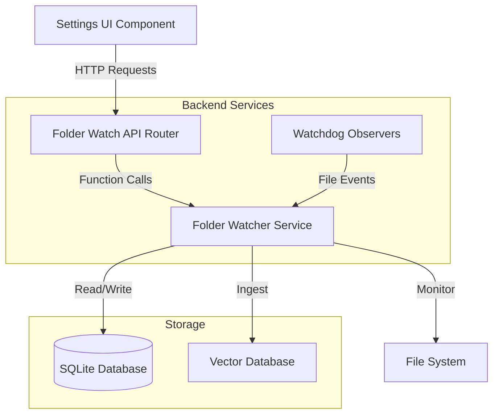

# Design Document: Folder Watch Auto-Ingest

## Overview

The Folder Watch Auto-Ingest feature completes the existing backend folder monitoring service by adding REST API endpoints, UI components in the Settings page, and automatic background watcher initialization. This enables users to manage watched folders through a web interface and automatically ingest new documents with hash-based deduplication.

The existing `server/services/folder_watcher.py` module provides the core functionality including:
- Database tables for watched folders, file hashes, and ingestion logs
- File hash calculation and deduplication logic
- File ingestion with parsing, embedding, and vector storage
- Watchdog-based file system event handling
- Folder scanning and statistics

This design focuses on exposing these capabilities through API endpoints and building a user-friendly interface for folder management.

## Architecture

### System Components



### Component Responsibilities

1. **API Router** (`server/routes/folder_watch.py`)
   - Exposes REST endpoints for folder management
   - Validates request parameters
   - Handles errors and returns appropriate HTTP status codes
   - Calls folder watcher service functions

2. **Folder Watcher Service** (`server/services/folder_watcher.py`)
   - Already implemented with all core functionality
   - Manages database operations
   - Handles file ingestion with deduplication
   - Provides watchdog event handlers

3. **Settings UI** (`src/pages/Settings.jsx`)
   - Displays folder management interface
   - Shows watched folders list with metadata
   - Provides manual scan triggers
   - Displays ingestion statistics

4. **Background Watchers**
   - Observer instances monitoring active folders
   - Automatically started on server initialization
   - Trigger ingestion on file creation events

## Components and Interfaces

### API Endpoints

#### POST /api/folder-watch/add

Add a new folder to the watch list.

**Request Body:**
```json
{
  "folder_path": "/path/to/folder"
}
```

**Response (200 OK):**
```json
{
  "success": true,
  "message": "Folder added successfully",
  "folder_path": "/path/to/folder"
}
```

**Error Response (400 Bad Request):**
```json
{
  "success": false,
  "message": "Folder does not exist"
}
```

**Error Response (409 Conflict):**
```json
{
  "success": false,
  "message": "Folder is already being watched"
}
```

#### DELETE /api/folder-watch/remove

Remove a folder from the watch list.

**Request Body:**
```json
{
  "folder_path": "/path/to/folder"
}
```

**Response (200 OK):**
```json
{
  "success": true,
  "message": "Folder removed successfully"
}
```

**Error Response (404 Not Found):**
```json
{
  "success": false,
  "message": "Folder not found in watch list"
}
```

#### GET /api/folder-watch/list

Get all watched folders with metadata.

**Response (200 OK):**
```json
{
  "folders": [
    {
      "id": 1,
      "folder_path": "/path/to/folder",
      "is_active": true,
      "created_at": "2024-01-15T10:30:00",
      "last_scan": "2024-01-15T14:20:00"
    }
  ]
}
```

#### POST /api/folder-watch/scan

Manually scan a folder for new files.

**Request Body:**
```json
{
  "folder_path": "/path/to/folder"
}
```

**Response (200 OK):**
```json
{
  "success": true,
  "total_files": 25,
  "ingested": 18,
  "duplicates": 5,
  "errors": 2,
  "message": "Scanned 25 files: 18 ingested, 5 duplicates, 2 errors"
}
```

**Error Response (404 Not Found):**
```json
{
  "success": false,
  "message": "Folder does not exist"
}
```

#### GET /api/folder-watch/statistics

Get file ingestion statistics.

**Response (200 OK):**
```json
{
  "total_files": 150,
  "total_duplicates": 23,
  "files_by_type": [
    {"type": "pdf", "count": 85},
    {"type": "xlsx", "count": 40},
    {"type": "txt", "count": 25}
  ],
  "recent_ingestions": [
    {
      "file_path": "/path/to/document.pdf",
      "status": "success",
      "chunks_created": 12,
      "timestamp": "2024-01-15T15:45:00"
    }
  ]
}
```

### API Router Implementation

The router module will follow the existing pattern used in `server/routes/share.py`:

```python
from fastapi import APIRouter, HTTPException
from pydantic import BaseModel
from server.services.folder_watcher import (
    add_watched_folder,
    remove_watched_folder,
    get_watched_folders,
    scan_folder_for_new_files,
    get_file_statistics
)

router = APIRouter()

class FolderPath(BaseModel):
    folder_path: str

@router.post("/folder-watch/add")
async def add_folder(data: FolderPath):
    # Implementation details in next section
    pass
```

### Settings UI Component Structure

The Settings page will be extended with a new "Folder Watch" section:

```jsx
const Settings = () => {
  const [watchedFolders, setWatchedFolders] = useState([]);
  const [statistics, setStatistics] = useState(null);
  const [newFolderPath, setNewFolderPath] = useState('');
  const [scanning, setScanning] = useState({});
  
  // Fetch watched folders and statistics on mount
  useEffect(() => {
    fetchWatchedFolders();
    fetchStatistics();
  }, []);
  
  const addFolder = async () => {
    // Call POST /api/folder-watch/add
  };
  
  const removeFolder = async (folderPath) => {
    // Call DELETE /api/folder-watch/remove
  };
  
  const scanFolder = async (folderPath) => {
    // Call POST /api/folder-watch/scan
  };
  
  return (
    <div>
      {/* Existing shareable links section */}
      
      {/* New folder watch section */}
      <div className="glass-panel">
        <h2>Folder Watch</h2>
        {/* Folder management UI */}
      </div>
      
      {/* Statistics section */}
      <div className="glass-panel">
        <h2>Ingestion Statistics</h2>
        {/* Statistics display */}
      </div>
    </div>
  );
};
```

### Background Watcher Management

Background watchers will be initialized in `server/main.py` on application startup:

```python
from contextlib import asynccontextmanager
from server.services.folder_watcher import (
    get_watched_folders,
    start_folder_watcher
)

# Store active observers globally
active_observers = {}

@asynccontextmanager
async def lifespan(app: FastAPI):
    # Startup: Initialize watchers for all active folders
    print("\n🔍 Initializing folder watchers...")
    folders = get_watched_folders()
    
    for folder in folders:
        if folder["is_active"]:
            observer, message = start_folder_watcher(folder["folder_path"])
            if observer:
                active_observers[folder["folder_path"]] = observer
                print(f"✅ {message}")
    
    print(f"✅ Started {len(active_observers)} folder watchers\n")
    
    yield
    
    # Shutdown: Stop all observers
    print("\n🛑 Stopping folder watchers...")
    for folder_path, observer in active_observers.items():
        observer.stop()
        observer.join()
        print(f"✅ Stopped watcher for: {folder_path}")

app = FastAPI(title="Askify RAG API", version="1.0.0", lifespan=lifespan)
```

## Data Models

### Database Schema

The database schema is already implemented in `folder_watcher.py`. Key tables:

**watched_folders**
- `id`: INTEGER PRIMARY KEY
- `folder_path`: TEXT UNIQUE NOT NULL
- `is_active`: BOOLEAN DEFAULT 1
- `created_at`: DATETIME
- `last_scan`: DATETIME

**file_hashes**
- `id`: INTEGER PRIMARY KEY
- `file_hash`: TEXT UNIQUE NOT NULL (SHA-256)
- `original_filename`: TEXT NOT NULL
- `file_size`: INTEGER
- `file_type`: TEXT
- `first_seen`: DATETIME
- `last_seen`: DATETIME
- `ingestion_count`: INTEGER DEFAULT 1
- `doc_id`: TEXT
- `metadata`: TEXT (JSON)

**file_ingestion_log**
- `id`: INTEGER PRIMARY KEY
- `file_path`: TEXT NOT NULL
- `file_hash`: TEXT NOT NULL
- `status`: TEXT NOT NULL (success, failed, skipped_duplicate)
- `error_message`: TEXT
- `chunks_created`: INTEGER
- `timestamp`: DATETIME

### Request/Response Models

Pydantic models for API validation:

```python
from pydantic import BaseModel, validator
from typing import Optional, List
from datetime import datetime

class FolderPath(BaseModel):
    folder_path: str
    
    @validator('folder_path')
    def validate_path(cls, v):
        if not v or not v.strip():
            raise ValueError('Folder path cannot be empty')
        return v.strip()

class WatchedFolder(BaseModel):
    id: int
    folder_path: str
    is_active: bool
    created_at: str
    last_scan: Optional[str]

class ScanResult(BaseModel):
    success: bool
    total_files: int
    ingested: int
    duplicates: int
    errors: int
    message: str

class FileTypeCount(BaseModel):
    type: str
    count: int

class RecentIngestion(BaseModel):
    file_path: str
    status: str
    chunks_created: int
    timestamp: str

class Statistics(BaseModel):
    total_files: int
    total_duplicates: int
    files_by_type: List[FileTypeCount]
    recent_ingestions: List[RecentIngestion]
```

## Error Handling

### API Error Responses

All endpoints will follow consistent error handling:

1. **400 Bad Request**: Invalid input (empty path, invalid format)
2. **404 Not Found**: Folder not found in watch list or filesystem
3. **409 Conflict**: Folder already being watched
4. **500 Internal Server Error**: Unexpected errors during processing

Error response format:
```json
{
  "success": false,
  "message": "Descriptive error message"
}
```

### Service Layer Error Handling

The existing service layer already handles errors gracefully:
- Returns tuple `(success: bool, message: str)` for operations
- Logs errors to console and database
- Catches exceptions during file processing
- Validates folder existence before operations

### UI Error Handling

The UI will display errors using toast notifications or inline error messages:

```jsx
const addFolder = async () => {
  try {
    const res = await fetch('/api/folder-watch/add', {
      method: 'POST',
      headers: { 'Content-Type': 'application/json' },
      body: JSON.stringify({ folder_path: newFolderPath })
    });
    
    const data = await res.json();
    
    if (!res.ok || !data.success) {
      setError(data.message || 'Failed to add folder');
      return;
    }
    
    setNewFolderPath('');
    fetchWatchedFolders();
  } catch (err) {
    setError('Network error: ' + err.message);
  }
};
```

## Testing Strategy

### Unit Tests

Unit tests will focus on specific functionality with concrete examples:

1. **API Endpoint Tests**
   - Test adding a valid folder path
   - Test adding an invalid/non-existent folder path
   - Test adding a duplicate folder path
   - Test removing an existing folder
   - Test removing a non-existent folder
   - Test listing folders returns correct format
   - Test scanning a folder returns correct result structure
   - Test statistics endpoint returns correct format

2. **UI Component Tests**
   - Test folder list renders correctly
   - Test add folder button calls API with correct data
   - Test remove button calls API with correct folder path
   - Test scan button triggers scan and displays results
   - Test error messages display correctly
   - Test statistics display correctly

3. **Integration Tests**
   - Test end-to-end folder addition and watcher initialization
   - Test file creation triggers automatic ingestion
   - Test duplicate file detection works correctly
   - Test manual scan processes all files in folder
   - Test watcher cleanup on folder removal

### Test Examples

```python
# API endpoint test example
def test_add_folder_success():
    response = client.post("/api/folder-watch/add", 
                          json={"folder_path": "/tmp/test_folder"})
    assert response.status_code == 200
    assert response.json()["success"] == True

def test_add_folder_invalid_path():
    response = client.post("/api/folder-watch/add",
                          json={"folder_path": "/nonexistent/path"})
    assert response.status_code == 400
    assert response.json()["success"] == False

# Deduplication test example
def test_duplicate_file_detection():
    # Create test file
    test_file = "/tmp/test_folder/document.pdf"
    
    # Ingest once
    success1, msg1, is_dup1 = ingest_file(test_file)
    assert success1 == True
    assert is_dup1 == False
    
    # Ingest again (should be detected as duplicate)
    success2, msg2, is_dup2 = ingest_file(test_file)
    assert success2 == True
    assert is_dup2 == True
    assert "duplicate" in msg2.lower()
```

### Manual Testing Checklist

1. Add a folder through UI and verify it appears in the list
2. Create a new file in the watched folder and verify automatic ingestion
3. Copy an existing file to the watched folder and verify duplicate detection
4. Click "Scan Now" and verify scan results display correctly
5. Remove a folder and verify watcher stops
6. Restart server and verify watchers restart for active folders
7. Verify statistics update after ingestion operations

## Implementation Notes

### Dependency Addition

Add `watchdog` to `server/requirements.txt`:
```
watchdog
```

### Router Registration

Update `server/main.py` to include the folder watch router:
```python
from server.routes.folder_watch import router as folder_watch_router

app.include_router(folder_watch_router, prefix="/api")
```

### Supported File Types

The system supports the following file extensions (already defined in service):
- `.pdf` - PDF documents
- `.txt` - Text files
- `.eml` - Email files
- `.xlsx`, `.xls` - Excel spreadsheets
- `.csv` - CSV files
- `.docx`, `.doc` - Word documents

### Performance Considerations

1. **File Hash Calculation**: Uses chunked reading (4096 bytes) to handle large files efficiently
2. **Database Queries**: Uses indexed columns (file_hash UNIQUE) for fast duplicate lookups
3. **Watcher Delay**: 1-second delay after file creation to ensure file is fully written
4. **Recursive Watching**: Watchers monitor subdirectories recursively

### Security Considerations

1. **Path Validation**: Validate folder paths to prevent directory traversal attacks
2. **File Type Restriction**: Only process supported file types
3. **Error Isolation**: Errors in one file don't stop processing of other files
4. **Database Transactions**: Use transactions for atomic operations

## Future Enhancements

Potential improvements not included in this initial implementation:

1. **Folder Pause/Resume**: Allow temporarily pausing watchers without removing folders
2. **File Filters**: Add pattern-based filtering (e.g., only watch `*.pdf`)
3. **Batch Operations**: Add/remove multiple folders at once
4. **Watcher Health Monitoring**: Detect and restart failed watchers
5. **Ingestion Queue**: Queue files for processing to handle bursts of new files
6. **Notification System**: Alert users when ingestion fails or duplicates are detected
7. **Folder Hierarchy**: Support parent-child folder relationships
8. **Cloud Storage Integration**: Watch cloud storage folders (S3, Google Drive, etc.)

