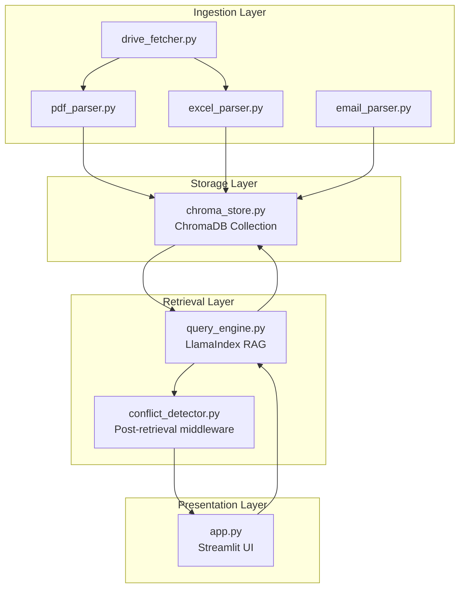

# Design Document: SME Knowledge Agent

## Overview

The SME Knowledge Agent is a RAG-based conversational system that ingests multi-format company documents (PDF policy files, Excel pricing sheets, email threads) into a unified vector store and answers employee queries with precise citations and autonomous conflict resolution.

The system architecture follows a pipeline pattern:
1. **Ingestion layer**: Parsers extract structured content and metadata from PDFs, Excel files, and emails
2. **Storage layer**: ChromaDB stores all document types in a single collection with rich metadata
3. **Retrieval layer**: LlamaIndex orchestrates vector search and returns chunks with full metadata
4. **Conflict detection middleware**: Post-retrieval logic identifies contradictions and applies date-priority resolution
5. **Presentation layer**: Streamlit UI renders answers, citations, conflict warnings, and ticket creation

Key architectural decisions:
- **Single collection design**: All doc types share one ChromaDB collection, differentiated by `doc_type` metadata
- **Post-retrieval conflict detection**: Runs as middleware after vector search, not inside the LLM prompt
- **Metadata-driven citations**: Row numbers, section titles, and email subjects come from metadata, not LLM extraction
- **Pre-generated embeddings**: Embeddings are persisted to disk before demo to ensure fast query response

## Architecture

### System Components



### Data Flow

**Ingestion flow:**
1. Knowledge Manager uploads files or connects Google Drive/Gmail
2. Parser extracts content and metadata (section titles, row numbers, email subjects)
3. Content is chunked and embedded using OpenAI text-embedding-3-small
4. Chunks + metadata + embeddings are stored in ChromaDB

**Query flow:**
1. Employee submits natural language query
2. Query is embedded and vector search retrieves top-k chunks from ChromaDB
3. Conflict detector analyzes retrieved chunks for contradictions
4. If conflict found: apply date-priority rule, generate diff explanation
5. LlamaIndex sends chunks + conflict context to GPT-4o-mini
6. UI renders answer with citations and conflict warning (if applicable)

### Portal Architecture

The system uses **2 portals**:

1. **Super Admin Console** (`admin_app.py`): Separate application for platform owner
   - Manages multiple company workspaces
   - Configures global governance rules
   - Not part of MVP scope

2. **Company Portal** (`app.py`): Single URL per company where all employees login
   - Single login page using streamlit-authenticator
   - Role-based dashboard rendering based on `st.session_state['role']`
   - Roles: Standard Employee, Team Lead, Knowledge Manager, System Admin

### Role-Based UI Design

All roles use the same `app.py` entry point. After authentication, the UI renders different components based on role:

```python
# Pseudo-code structure
if st.session_state['role'] == 'employee':
    render_query_interface()
    render_ticket_creation()
elif st.session_state['role'] == 'team_lead':
    render_query_interface()
    render_ticket_creation()
    render_conflict_audit_dashboard()
elif st.session_state['role'] == 'knowledge_manager':
    render_document_upload()
    render_ingestion_dashboard()
elif st.session_state['role'] == 'system_admin':
    render_workspace_config()
    render_governance_rules()
```

Authentication uses `streamlit-authenticator` with `config.yaml` storing usernames, hashed passwords, and role assignments.

## Components and Interfaces

### Ingestion Components

#### pdf_parser.py
```python
def extract_pdf_sections(file_path: str) -> List[PDFSection]:
    """
    Extracts table of contents and named sections from PDF.
    
    Args:
        file_path: Path to PDF file
        
    Returns:
        List of PDFSection objects with metadata:
        - source: filename
        - section_title: extracted from TOC
        - section_number: hierarchical numbering (e.g., "2.3.1")
        - page_number: starting page
        - doc_date: parsed from content or filename
        - doc_type: "policy"
        - content: section text
    """
    pass

def parse_date_from_filename(filename: str) -> datetime:
    """
    Extracts date from filename patterns like:
    - Refund_Policy_v2_March2024.pdf → 2024-03-01
    - Policy_2024-03-15.pdf → 2024-03-15
    """
    pass
```

#### excel_parser.py
```python
def extract_excel_rows(file_path: str) -> List[ExcelRow]:
    """
    Converts each Excel data row into natural language string.
    Uses openpyxl with data_only=True to get computed formula values.
    
    Args:
        file_path: Path to Excel file
        
    Returns:
        List of ExcelRow objects with metadata:
        - source: filename
        - sheet_name: worksheet name
        - row_number: 1-indexed row number
        - client: extracted from "Client" column if present
        - doc_date: from "Date" column or file metadata
        - doc_type: "excel"
        - content: natural language string like "Client: Acme Corp, Product: Widget, Price: $500"
    """
    pass

def row_to_natural_language(row: Dict[str, Any]) -> str:
    """
    Converts row dict to natural language preserving all column values.
    Example: {"Client": "Acme", "Price": 500} → "Client: Acme, Price: $500"
    """
    pass
```

#### email_parser.py
```python
def parse_eml_file(file_path: str) -> List[EmailMessage]:
    """
    Parses EML file and extracts all messages in thread.
    
    Args:
        file_path: Path to .eml file
        
    Returns:
        List of EmailMessage objects with metadata:
        - sender: email address
        - doc_date: sent timestamp
        - subject: email subject line
        - thread_id: extracted from headers
        - client_keyword: None for manual uploads
        - doc_type: "email"
        - content: email body (plain text preferred)
    """
    pass

def search_gmail_by_keyword(keyword: str, credentials) -> List[EmailMessage]:
    """
    Searches Gmail API for emails matching client keyword.
    Optional enhancement - not required for MVP.
    """
    pass
```

#### drive_fetcher.py
```python
def download_drive_folder(folder_id: str, credentials) -> List[str]:
    """
    Lists and downloads all PDFs from Google Drive folder.
    Exports all Google Sheets as .xlsx files.
    
    Returns:
        List of local file paths for downloaded documents
    """
    pass
```

### Storage Component

#### chroma_store.py
```python
def init_chroma_collection(persist_directory: str = "./chroma_db") -> chromadb.Collection:
    """
    Initializes ChromaDB collection with persistence.
    Single collection stores all doc types (PDF, Excel, email).
    """
    pass

def upsert_chunks(
    collection: chromadb.Collection,
    chunks: List[Dict[str, Any]],
    embeddings: List[List[float]]
) -> None:
    """
    Upserts document chunks with metadata and embeddings.
    
    Args:
        collection: ChromaDB collection
        chunks: List of dicts with keys: id, content, metadata
        embeddings: Pre-computed embeddings from OpenAI
        
    Metadata schema (all doc types):
        - source: filename
        - doc_type: "policy" | "excel" | "email"
        - doc_date: ISO 8601 datetime string
        - section_title: (PDF only) section name
        - section_number: (PDF only) hierarchical number
        - page_number: (PDF only) starting page
        - sheet_name: (Excel only) worksheet name
        - row_number: (Excel only) 1-indexed row
        - client: (Excel only) client name if present
        - sender: (email only) email address
        - subject: (email only) email subject
        - thread_id: (email only) thread identifier
    """
    pass
```

### Retrieval Components

#### query_engine.py
```python
def create_query_engine(
    collection: chromadb.Collection,
    llm: OpenAI,
    embed_model: OpenAIEmbedding
) -> VectorStoreIndex:
    """
    Creates LlamaIndex query engine with ChromaDB backend.
    
    Args:
        collection: ChromaDB collection
        llm: OpenAI GPT-4o-mini instance
        embed_model: OpenAI text-embedding-3-small instance
        
    Returns:
        VectorStoreIndex configured for RAG queries
    """
    pass

def query_with_metadata(
    query_engine: VectorStoreIndex,
    query: str,
    doc_type_filter: Optional[str] = None,
    top_k: int = 5
) -> QueryResult:
    """
    Executes query and returns results with full metadata.
    
    Args:
        query_engine: LlamaIndex query engine
        query: Natural language query
        doc_type_filter: Optional filter for "policy", "excel", or "email"
        top_k: Number of chunks to retrieve
        
    Returns:
        QueryResult with:
        - answer: LLM-generated response
        - source_chunks: List of retrieved chunks with full metadata
    """
    pass
```

#### conflict_detector.py
```python
def detect_conflicts(chunks: List[Dict[str, Any]]) -> List[Conflict]:
    """
    Analyzes retrieved chunks for contradictions.
    
    Conflict criteria:
    - Same section_title (for PDFs) or same client (for Excel/email)
    - Different doc_dates
    - Different content (semantic similarity < 0.9)
    
    Returns:
        List of Conflict objects with:
        - winner: chunk with most recent doc_date
        - rejected: list of older conflicting chunks
        - diff_explanation: plain-language description of changes
    """
    pass

def apply_date_priority_rule(conflicting_chunks: List[Dict[str, Any]]) -> Dict[str, Any]:
    """
    Selects chunk with most recent doc_date as winner.
    """
    pass

def generate_diff_explanation(winner: Dict[str, Any], rejected: Dict[str, Any]) -> str:
    """
    Generates plain-language diff explanation.
    Example: "Refund window changed from 30 days (Policy v1, 2023-01-15) to 60 days (Policy v2, 2024-03-01)"
    """
    pass

def flag_outdated_email(email_chunk: Dict[str, Any], pdf_chunk: Dict[str, Any]) -> bool:
    """
    Returns True if email predates PDF on same topic.
    Topic matching uses section_title or client field.
    """
    pass
```

### Presentation Component

#### app.py
```python
def render_query_interface():
    """
    Renders query input box and displays answer with citations.
    Shows conflict warning banner if conflicts were detected.
    """
    pass

def render_citation(chunk: Dict[str, Any]) -> str:
    """
    Formats citation based on doc_type:
    - PDF: "Refund Policy v2 (Section 3.2: Returns, Page 5)"
    - Excel: "Pricing_2024.xlsx (Sheet: Q1, Row 42)"
    - Email: "From: john@acme.com (2024-01-15, Subject: Discount approval)"
    """
    pass

def render_conflict_warning(conflict: Conflict):
    """
    Displays red warning banner with "View side-by-side" button.
    Clicking button shows winner vs rejected chunks with diff highlighting.
    """
    pass

def render_ticket_creation(query_context: Dict[str, Any]):
    """
    Pre-populates ticket form with:
    - client_name: from Excel metadata
    - query_text: user's original query
    - ai_answer: generated response
    - source_citations: formatted citation strings
    - conflict_flag: True if conflict was resolved
    - resolution_reasoning: diff explanation if conflict exists
    """
    pass

def render_ingestion_dashboard(ingestion_summary: Dict[str, int]):
    """
    Displays summary statistics:
    - total_documents: count of processed files
    - total_sections: count of PDF sections indexed
    - total_excel_rows: count of Excel rows stored
    - total_email_messages: count of email messages parsed
    
    Allows clicking on document to preview extracted sections/rows.
    """
    pass
```

## Data Models

### Chunk Metadata Schema

All chunks stored in ChromaDB follow this unified schema:

```python
{
    # Common fields (all doc types)
    "id": str,  # unique chunk identifier
    "source": str,  # filename
    "doc_type": str,  # "policy" | "excel" | "email"
    "doc_date": str,  # ISO 8601 datetime
    
    # PDF-specific fields
    "section_title": Optional[str],
    "section_number": Optional[str],
    "page_number": Optional[int],
    
    # Excel-specific fields
    "sheet_name": Optional[str],
    "row_number": Optional[int],
    "client": Optional[str],
    
    # Email-specific fields
    "sender": Optional[str],
    "subject": Optional[str],
    "thread_id": Optional[str],
    "client_keyword": Optional[str]
}
```

### Conflict Object

```python
@dataclass
class Conflict:
    winner: Dict[str, Any]  # chunk with most recent doc_date
    rejected: List[Dict[str, Any]]  # older conflicting chunks
    diff_explanation: str  # plain-language description
    conflict_type: str  # "version_update" | "cross_doc_type" | "policy_change"
```

### Query Result

```python
@dataclass
class QueryResult:
    answer: str  # LLM-generated response
    source_chunks: List[Dict[str, Any]]  # retrieved chunks with metadata
    conflicts: List[Conflict]  # detected conflicts (empty if none)
    response_time_ms: int  # for performance monitoring
```

## Correctness Properties

*A property is a characteristic or behavior that should hold true across all valid executions of a system—essentially, a formal statement about what the system should do. Properties serve as the bridge between human-readable specifications and machine-verifiable correctness guarantees.*

### Property 1: PDF TOC extraction completeness

*For any* valid PDF file with a table of contents, the extraction process SHALL identify and extract all named sections with their hierarchical structure preserved.

**Validates: Requirements 1.1**

### Property 2: Metadata preservation across storage

*For any* document chunk (PDF section, Excel row, or email message) with complete metadata, storing the chunk in ChromaDB and then retrieving it SHALL preserve all metadata fields without loss or corruption.

**Validates: Requirements 1.2, 2.2, 3.3**

### Property 3: Filename date extraction accuracy

*For any* filename containing a date pattern (e.g., "Policy_March2024.pdf", "Doc_2024-03-15.pdf"), the date extraction function SHALL parse and return the correct date value.

**Validates: Requirements 1.3**

### Property 4: Excel row serialization preserves data

*For any* Excel data row with multiple columns, converting the row to a natural language string SHALL preserve all column names and values such that they are present in the output string.

**Validates: Requirements 2.1**

### Property 5: Excel formula evaluation

*For any* Excel file containing formula cells, the ingestion process SHALL store the computed value of each formula, not the raw formula expression.

**Validates: Requirements 2.3**

### Property 6: EML parsing completeness

*For any* valid EML file, the parser SHALL extract all required fields (sender, date, subject, body) from each message in the thread without missing data.

**Validates: Requirements 3.1**

### Property 7: Citation formatting completeness

*For any* document chunk with metadata, the citation formatting function SHALL include all required fields for that doc_type (filename + section/row/subject identifiers) in the output string.

**Validates: Requirements 5.1, 5.2, 5.3**

### Property 8: Multi-doc-type retrieval

*For any* query submitted to the system without a doc_type filter, the retrieval results MAY include chunks from all document types (PDF, Excel, email) if they are semantically relevant.

**Validates: Requirements 4.1**

### Property 9: Retrieval metadata preservation

*For any* chunk retrieved from ChromaDB, the returned result SHALL include the complete metadata dictionary that was stored during ingestion.

**Validates: Requirements 4.2**

### Property 10: Doc type filtering accuracy

*For any* query with a doc_type filter applied, all returned chunks SHALL have a doc_type field matching the specified filter value, with no chunks of other types included.

**Validates: Requirements 4.3**

### Property 11: Conflict detection and date-priority resolution

*For any* pair of retrieved chunks that share the same section_title (or client field), have different doc_dates, and have semantically different content, the conflict detector SHALL identify this as a conflict and select the chunk with the most recent doc_date as the winner.

**Validates: Requirements 6.1, 6.2**

### Property 12: Diff explanation generation

*For any* detected conflict between two chunks, the system SHALL generate a non-empty diff explanation string that describes what changed between the older and newer versions.

**Validates: Requirements 6.3**

### Property 13: Cross-doc-type outdated flagging

*For any* email chunk and PDF chunk that share the same topic (matched by section_title or client field), if the email's doc_date is earlier than the PDF's doc_date, the system SHALL flag the email as containing outdated advice.

**Validates: Requirements 6.4**

### Property 14: Ticket field population

*For any* query context (including query text, AI answer, source citations, and conflict status), creating a ticket SHALL populate all required fields (client_name, query_text, ai_answer, source_citations, conflict_flag) with the correct values from the context.

**Validates: Requirements 8.1, 8.2**

### Property 15: Ingestion summary accuracy

*For any* completed ingestion run with a known quantity of documents, sections, rows, and messages, the summary statistics SHALL accurately count and report the total number of each item type processed.

**Validates: Requirements 10.1**

## Error Handling

### Ingestion Errors

**PDF parsing failures:**
- If TOC extraction fails: Log warning, fall back to page-by-page chunking without section metadata
- If date parsing fails from both content and filename: Use file modification timestamp as fallback
- If PDF is corrupted or password-protected: Skip file, log error, continue with remaining files

**Excel parsing failures:**
- If formula evaluation fails (data_only=True returns None): Store empty string, log warning
- If sheet is empty or has no data rows: Skip sheet, log warning
- If client column is missing: Set client metadata to None, continue processing

**Email parsing failures:**
- If EML file is malformed: Skip file, log error
- If required fields (sender, date, subject) are missing: Skip message, log warning
- If Gmail API authentication fails: Fall back to manual .eml upload, display user-friendly error message

**Google Drive/Gmail API errors:**
- If OAuth flow times out after 45 minutes: Fall back to manual file upload, preserve existing ingestion pipeline
- If API rate limit exceeded: Implement exponential backoff, retry up to 3 times
- If folder/email not found: Display clear error message, allow user to correct folder ID/keyword

### Query Errors

**Retrieval failures:**
- If ChromaDB connection fails: Display error message, suggest checking persistence directory
- If embedding API call fails: Retry once, then display error message to user
- If no chunks retrieved (empty results): Return "No relevant documents found" message

**Conflict detection errors:**
- If diff generation fails: Log error, display generic "Content has changed" message
- If date comparison fails due to invalid date format: Skip conflict detection for that pair, log warning

**LLM errors:**
- If OpenAI API call fails: Retry once with exponential backoff, then display error message
- If response is empty or malformed: Display "Unable to generate answer" message, show raw retrieved chunks
- If response exceeds token limit: Truncate context, retry with fewer chunks

### UI Errors

**Authentication errors:**
- If streamlit-authenticator config.yaml is missing: Display setup instructions
- If login fails: Display "Invalid credentials" message
- If role is not recognized: Default to "employee" role, log warning

**Ticket creation errors:**
- If required fields are missing from query context: Disable "Create Ticket" button, show tooltip
- If CRM integration fails: Save ticket locally as JSON, allow manual export

## Testing Strategy

### Unit Testing

Unit tests focus on specific examples, edge cases, and error conditions for individual components:

**Ingestion layer:**
- PDF parser: Test specific PDFs with known TOC structures, edge cases (no TOC, nested sections, special characters)
- Excel parser: Test specific spreadsheets with formulas, empty cells, merged cells
- Email parser: Test specific EML files with various header formats, multipart messages, attachments
- Date extraction: Test specific filename patterns, edge cases (ambiguous dates, non-standard formats)

**Storage layer:**
- ChromaDB operations: Test specific upsert/query operations, edge cases (duplicate IDs, missing metadata)

**Retrieval layer:**
- Query engine: Test specific queries with known expected results
- Conflict detector: Test specific conflict scenarios (same section different dates, cross-doc-type conflicts)
- Citation formatter: Test specific chunks with various metadata combinations

**Presentation layer:**
- UI rendering: Test specific scenarios (conflict warning display, ticket pre-population)
- Role-based access: Test specific role combinations and permission checks

### Property-Based Testing

Property tests verify universal properties across all inputs using **Hypothesis** (Python PBT library):

**Configuration:**
- Minimum 100 iterations per property test
- Each test tagged with comment: `# Feature: sme-knowledge-agent, Property {number}: {property_text}`

**Test implementation:**
- Property 1: Generate random PDFs with varying TOC structures, verify extraction completeness
- Property 2: Generate random chunks with full metadata, verify storage round-trip preserves all fields
- Property 3: Generate random filenames with date patterns, verify extraction accuracy
- Property 4: Generate random Excel rows, verify serialization preserves all column data
- Property 5: Generate Excel files with various formulas, verify computed values are stored
- Property 6: Generate random EML files, verify all fields are extracted
- Property 7: Generate random chunks with metadata, verify citation formatting includes all required fields
- Property 8: Generate queries against mixed doc types, verify retrieval can return all types
- Property 9: Generate random chunks, verify retrieval preserves metadata
- Property 10: Generate queries with doc_type filters, verify filtering accuracy
- Property 11: Generate pairs of chunks with varying attributes, verify conflict detection and resolution
- Property 12: Generate conflicts, verify diff explanation is generated
- Property 13: Generate email/PDF pairs, verify outdated flagging logic
- Property 14: Generate random query contexts, verify ticket field population
- Property 15: Generate ingestion runs with known quantities, verify summary accuracy

### Integration Testing

Integration tests verify external service interactions with 1-3 representative examples:

**Google Drive API:**
- Test folder listing and PDF download with real Drive folder
- Test Google Sheets export with real spreadsheet
- Test OAuth flow and error handling

**Gmail API:**
- Test email search by keyword with real Gmail account
- Test thread ingestion with real email data
- Test authentication and rate limiting

**ChromaDB persistence:**
- Test embedding persistence and reload across application restarts
- Test collection initialization with existing data

**End-to-end query flow:**
- Test complete flow from ingestion to query to answer with real documents
- Test conflict detection with real policy versions
- Test ticket creation with real query context

### Performance Testing

**Query response time:**
- Target: < 3 seconds from query submission to answer display
- Test with varying collection sizes (100, 1000, 10000 chunks)
- Test with varying query complexity

**Ingestion throughput:**
- Measure documents processed per minute for each doc type
- Test with large batches (100+ documents)

**Embedding generation:**
- Measure time to generate embeddings for typical document set
- Verify pre-generated embeddings load correctly

### Manual Testing

**UI/UX validation:**
- Test role-based dashboard rendering for all 4 roles
- Test conflict warning banner visibility and side-by-side view
- Test ticket creation form pre-population
- Test ingestion dashboard document preview

**Citation accuracy:**
- Manually verify PDF section citations match actual document sections
- Manually verify Excel row citations match actual spreadsheet rows
- Manually verify email citations match actual email metadata

**Conflict resolution quality:**
- Manually review diff explanations for clarity and accuracy
- Verify date-priority rule produces expected winners
- Verify outdated email flagging is appropriate

